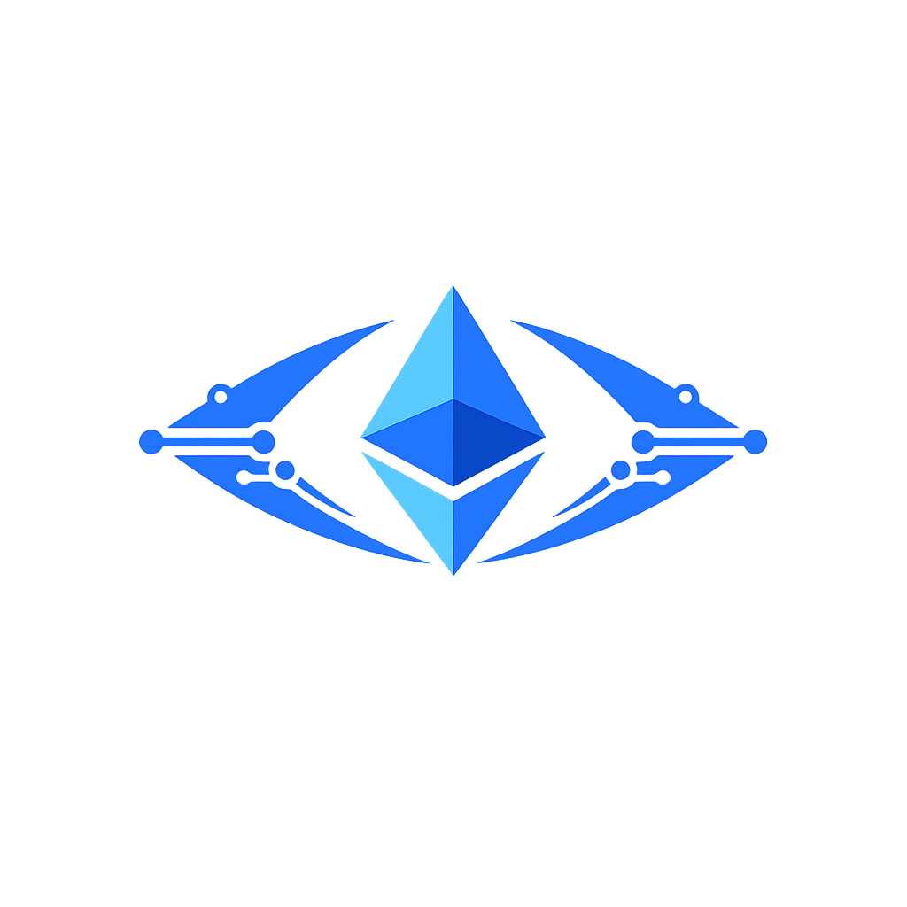

<p align="center">
  
</p>

<h1 align="center">ENSight Web</h1>

<p align="center">
  Web interface and dApp layer for ENSight — onboarding users, showcasing the extension, and powering on-chain experiences.
</p>

<p align="center">
  <a href="https://ethglobal.com" target="_blank">
    
  </a>
  <a href="https://ethglobal.com/events/hackmoney2026/" target="_blank">
    
  </a>
  
</p>

---

## 🌐 Web & dApp Flow

### How it works

1. User lands on ENSight Web  
2. Learns about ENSight & installs extension  
3. Connects wallet (optional)  
4. Views ENS-based context & safety signals  
5. Interacts with on-chain features (future)  
6. Extension + backend power real-time insights  

---

## ⚙️ Tech Stack

- Next.js / React  
- TypeScript  
- Web3 libraries (ethers / wagmi as needed)  
- ENSight Backend APIs  

---

## 🧩 Role in ENSight

This repository contains the **product and dApp layer** of ENSight — responsible for:

- User onboarding  
- Extension installation flows  
- On-chain context views  
- Future decentralized features  

It connects the ENSight ecosystem into a cohesive user experience.

---

## 🚀 Why ENSight Web

ENSight Web makes ENSight accessible and scalable by:

- Introducing users to Web3 safety tooling  
- Bridging off-chain intelligence with on-chain identity  
- Powering trust-aware dApp experiences  

---

## 🛠 Project Setup

### Prerequisites

- Node.js 18+  
- npm or pnpm  

### Install

```bash
git clone https://github.com/ensight-org/ensight-web.git
cd ensight-web
npm install
```

### Run locally

```bash
npm run dev
```

App will be available at: `http://localhost:3000`

## 🤝 Contributing

Contributions welcome across:
- UI/UX improvements
- Web3 integrations
- Performance optimizations
- dApp feature development

---

Part of the ENSight ecosystem • Built for open Web3 infrastructure
